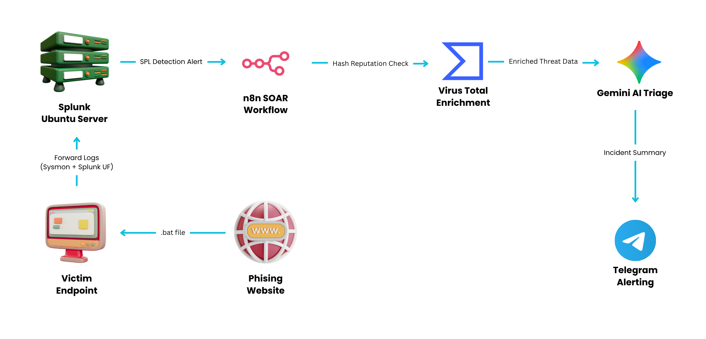
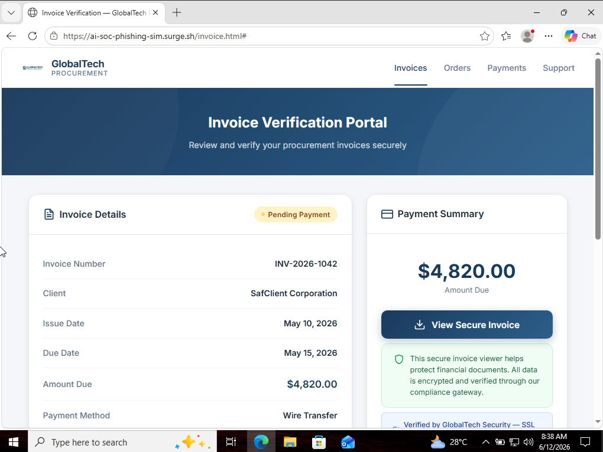
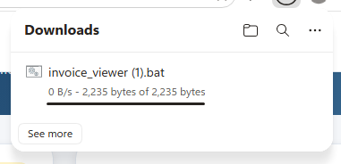
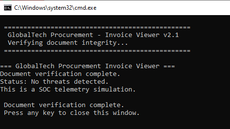
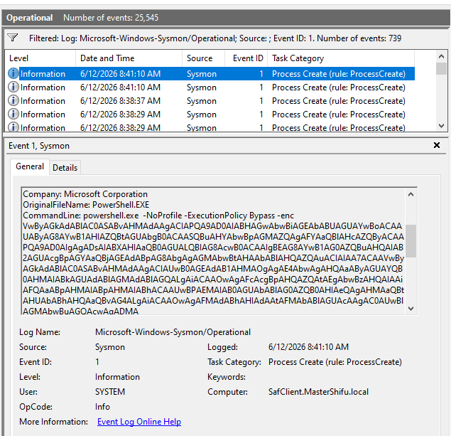
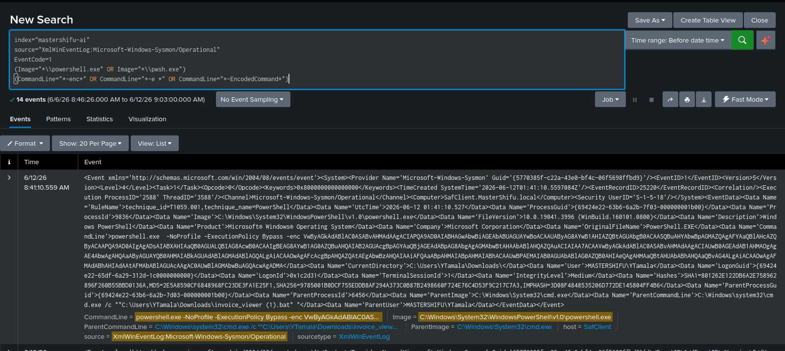
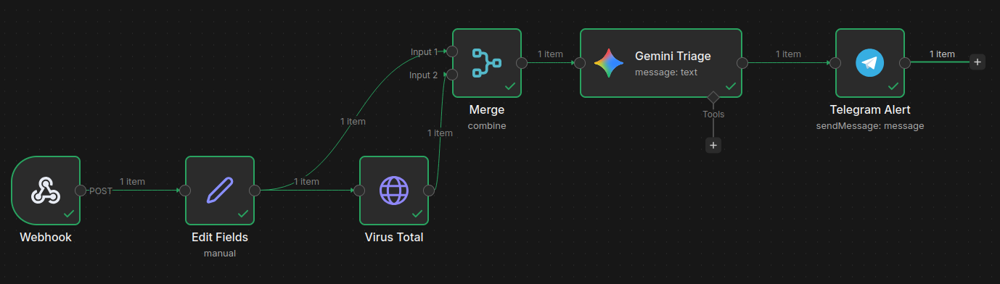
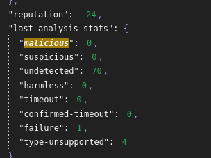
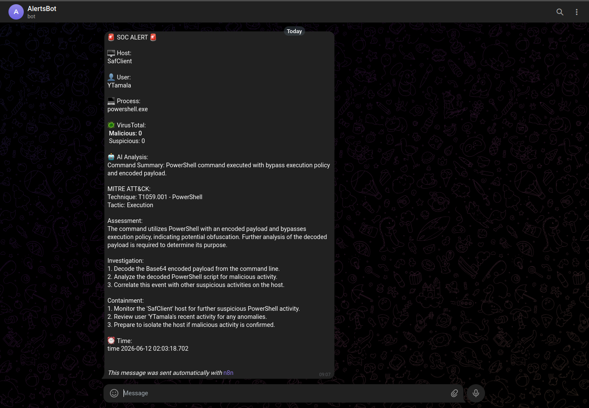

# 🔐 AI-Assisted SOC Detection and Triage for Encoded PowerShell Attacks

## 📌 Overview

This project demonstrates an end-to-end Security Operations Center (SOC) workflow designed to detect, enrich, and triage suspicious PowerShell activity originating from a phishing simulation.

The environment integrates:

* Splunk Enterprise (SIEM) for log collection and detection
* Sysmon for endpoint telemetry
* Splunk Universal Forwarder for log forwarding
* n8n (SOAR) for workflow automation
* VirusTotal for threat intelligence enrichment
* Gemini AI for automated incident triage
* Telegram for analyst notification

The objective is to simulate a realistic phishing attack chain and automate the investigation process typically performed by SOC analysts.

---

## Lab Environment

| Component | Technology |
|------------|------------|
| SIEM | Splunk Enterprise |
| Endpoint Monitoring | Sysmon |
| Log Forwarding | Splunk Universal Forwarder |
| SOAR | n8n |
| Threat Intelligence | VirusTotal |
| AI Triage | Gemini AI |
| Notification | Telegram |
| Server OS | Ubuntu Server 24.04 |
| Endpoint OS | Windows 11 |

---

## 🎯 Objectives

* Simulate a phishing-based attack scenario
* Detect encoded PowerShell execution using Splunk
* Collect endpoint telemetry with Sysmon
* Automate incident handling using n8n
* Enrich alerts using VirusTotal threat intelligence
* Generate AI-assisted incident analysis using Gemini
* Deliver actionable alerts to SOC analysts via Telegram
* Demonstrate an end-to-end SOC detection and response workflow

---

## 🏗️ Architecture



---

## 🎣 Attack Scenario

The phishing simulation follows the attack chain below:

1. User visits a phishing website
2. User downloads a malicious-looking invoice.bat file
3. User executes the file
4. PowerShell launches using an encoded command
5. Sysmon logs the process creation event
6. Splunk detects the suspicious activity
7. n8n automates alert enrichment
8. VirusTotal performs hash reputation checks
9. Gemini AI generates an analyst-friendly summary
10. Telegram delivers the incident notification

---

## 🔄 Workflow

### Attack Execution

* Phishing website delivers invoice.bat
* Victim executes the file
* Encoded PowerShell command is launched

### Detection

* Sysmon captures Event ID 1 (Process Creation)
* Splunk Universal Forwarder sends logs to Splunk
* Splunk identifies encoded PowerShell execution

### Automation & Enrichment

* Splunk triggers a webhook alert
* n8n receives the alert
* VirusTotal performs hash reputation enrichment
* Alert data is forwarded to Gemini AI

### AI-Assisted Triage

Gemini AI generates:

* Command summary
* MITRE ATT&CK mapping
* Threat assessment
* Investigation recommendations
* Containment recommendations

### Notification

* Final incident summary is sent to Telegram
* SOC analyst receives the alert for review

---

## 🧰 Technologies Used

* Splunk Enterprise – Security Information and Event Management (SIEM)
* Sysmon – Windows endpoint telemetry
* Splunk Universal Forwarder – Log forwarding
* n8n – Security Orchestration Automation and Response (SOAR)
* VirusTotal API – Threat intelligence enrichment
* Gemini AI – Incident triage assistance
* Telegram Bot API – Alert notification
* Windows 11 – Victim endpoint
* Ubuntu Server – Splunk server

---

## 🔍 Detection Logic (Splunk SPL)

```spl
index="mastershifu-ai"
source="XmlWinEventLog:Microsoft-Windows-Sysmon/Operational"
EventCode=1
(Image="*\\powershell.exe" OR Image="*\\pwsh.exe")
(CommandLine="*-enc*" OR CommandLine="*-e *" OR CommandLine="*-EncodedCommand*")
| table _time, ComputerName, User, CommandLine, ParentImage
```

---

## 🛡️ MITRE ATT&CK Mapping

| Technique                       | ID        |
| ------------------------------- | --------- |
| PowerShell                      | T1059.001 |
| Obfuscated Files or Information | T1027     |

---

## 🖼️ Screenshots

### 🔹 Phishing Website



### 🔹 Invoice Download



### 🔹 Invoice Execution



### 🔹 Sysmon Event



### 🔹 Splunk Detection



### 🔹 n8n Workflow



### 🔹 VirusTotal Enrichment



### 🔹 Telegram Alert



---

## 🧪 Testing & Validation

### Test Scenario

* Open phishing website
* Download invoice.bat
* Execute invoice.bat
* Verify Sysmon Event ID 1 generation
* Verify Splunk detection
* Verify webhook delivery to n8n
* Verify VirusTotal enrichment
* Verify Gemini AI analysis
* Verify Telegram alert delivery

### Result

* Encoded PowerShell activity successfully detected
* Threat intelligence enrichment successfully performed
* AI-generated triage successfully produced
* Telegram alert successfully delivered
* End-to-end workflow executed successfully

---

## 📚 Lessons Learned

* Building detection logic using Splunk SPL
* Collecting endpoint telemetry with Sysmon
* Automating workflows with n8n
* Integrating threat intelligence using VirusTotal
* Applying MITRE ATT&CK techniques to detections
* Using AI to assist SOC alert triage
* Designing an end-to-end detection and response pipeline

---

## ⭐ Key Takeaway

This project demonstrates how SIEM, SOAR, Threat Intelligence, and AI-assisted triage can be integrated into a single workflow to improve SOC visibility and accelerate incident investigation.

---

## Disclaimer

This project was developed in a controlled lab environment for educational and defensive security purposes only.

The phishing website and BAT file were created solely to simulate adversary behavior and validate detection and response workflows.
